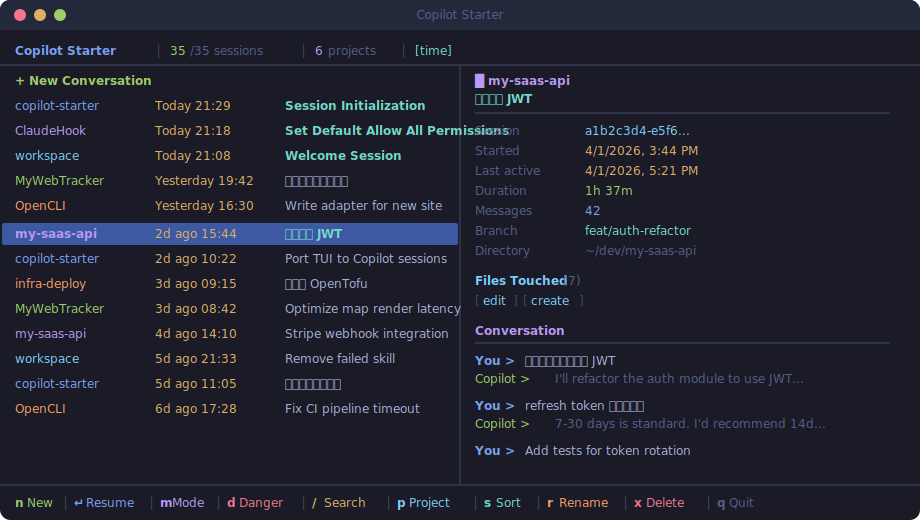

<p align="center">
  
  <br/>
  
  
  
  
</p>

<h1 align="center">🤖 Copilot Starter</h1>

<p align="center">
  <strong>Your homepage for the GitHub Copilot CLI.</strong> All your sessions, at a glance.<br/>
  <strong>GitHub Copilot CLI 的主页。</strong>你的所有会话，一目了然。
</p>

<p align="center">
  Built for <strong>AI-native developer workflows</strong>: local-first, searchable, resumable, and fast — so the next session starts faster than the last one ended.
</p>

<p align="center">
  
</p>

---

# English

## The Problem

The Copilot CLI keeps a rich history of every session — but resuming one means staring at a list of opaque UUIDs:

```
3ee0f33a-b882-424f-9ba4-260342e4dd5b
87570bab-ee92-4681-9591-54abf2fcb486
...30+ more UUIDs...
```

If you use the Copilot CLI as part of a real development loop, session history stops being archive data and becomes working context. You need to find old agent work by repo, topic, and intent — not by opaque IDs.

## The Solution

```bash
copilot-starter
```

Beautiful split-pane UI with Tokyo Night colors. The left panel shows every session with project, time, and topic. The right panel previews the full conversation. Not UUIDs — your **actual words**.

`copilot-starter` is built for developers treating coding agents as part of a daily workflow: keep everything local, cut resume friction, and make past conversations actually reusable.

## 🔍 Search — The Killer Feature

Press `/` and start typing. **That's it.** No Enter needed.

Searches across **everything** — project names, Git branches, conversation content. Results update as you type, `↑↓` to navigate instantly.

- `auth` → all auth-related sessions
- `refactor` → that cleanup from last week
- `web-app fix` → bug fixes in a specific project

**No modes. No confirmation. Just type and go.**

## Features

| | Feature | Description |
|---|---|---|
| 🎨 | **Beautiful TUI** | Tokyo Night color scheme, split-pane layout, feels native in your terminal |
| ✨ | **New Session** | Launch a fresh conversation in one keystroke |
| 🔍 | **Instant Search** | Fuzzy search across everything |
| 📂 | **Project Filter** | Press `p` to filter by project |
| ⚡ | **One-Key Resume** | Arrow, Enter, you're back in the conversation |
| 📋 | **Session Preview** | Full metadata + conversation history in the right panel |
| 🔀 | **Sort Modes** | Sort by time, size, messages, or project |
| 📎 | **Copy ID** | Press `c` to copy session ID |
| 🔒 | **Launch Modes** | Press `m` to configure, `d` for quick allow-all (danger) resume |
| ✏️ | **Rename Sessions** | Press `r` to rename, supports CJK input |
| 🗑️ | **Hide Sessions** | Press `x` to remove sessions from the list |
| ⌨️ | **Vim Keybindings** | `j`/`k` navigate, `g`/`G` jump to top/bottom |
| 🧠 | **Smart CLI** | Auto-detects `mai-copilot` vs `copilot` |
| 🔐 | **100% Local** | No network, no telemetry, no data leaves your machine |

## Install

From source:

```bash
git clone https://github.com/vippeterhou/copilot-starter.git
cd copilot-starter
npm install
npm link
```

Then run:

```bash
copilot-starter
```

## CLI Options

```bash
copilot-starter              # Launch interactive TUI
copilot-starter --list [N]   # Print latest N sessions (default: 30)
copilot-starter --version    # Show version
copilot-starter --help       # Show help
```

## Keyboard Shortcuts

| Key | Action |
|:---:|--------|
| `↑` `↓` / `j` `k` | Navigate sessions |
| `Enter` | Start new / resume selected session |
| `n` | New session |
| `d` | Resume with `--allow-all` (danger mode) |
| `m` | Launch mode picker |
| `r` | Rename session |
| `/` | Search |
| `Backspace` | Edit search, auto-exit when empty |
| `Esc` | Clear filter |
| `p` | Filter by project |
| `s` | Cycle sort mode (time/size/messages/project) |
| `c` | Copy session ID |
| `x` / `Delete` | Hide session |
| `g` / `G` | Jump to top / bottom |
| `Ctrl-D` / `Ctrl-U` | Page down / up |
| `q` / `Ctrl-C` | Quit |

## Launch Modes

The `m` picker (and the global default) let you choose how a resumed or new session starts. Each maps to a real Copilot CLI flag:

| Mode | Flag | Meaning |
|------|------|---------|
| `default` | _(none)_ | Interactive, prompts for permission |
| `allow-all-tools` | `--allow-all-tools` | Auto-run tools without confirmation |
| `allow-all` | `--allow-all` | Allow all tools, paths, and URLs ⚠️ |
| `plan` | `--mode plan` | Start in plan mode |
| `autopilot` | `--allow-all-tools --mode autopilot` | Autonomous autopilot ⚠️ |

Press `d` for a one-key "danger" resume (`--allow-all`).

## How It Works

The Copilot CLI stores its session metadata and conversation turns in a SQLite database at `~/.copilot/session-store.db`, with per-session artifacts under `~/.copilot/session-state/<id>/`. `copilot-starter` reads that database **read-only** (via the system `sqlite3` binary, safe even while Copilot is running), parses metadata and conversation content, and presents it in a fast split-pane UI.

Renames and hidden sessions are stored separately in `~/.copilot/copilot-starter-meta.json` so your own Copilot data is never modified by browsing. **Everything stays local. No API calls, no telemetry.**

## Requirements

- **Node.js** >= 18
- **GitHub Copilot CLI** ([`copilot`](https://docs.github.com/copilot/github-copilot-in-the-cli) in PATH)
- **`sqlite3`** CLI (preinstalled on macOS; `apt-get install sqlite3` on Linux)

## License

MIT

---

# 中文

## 痛点

GitHub Copilot CLI 会完整记录你的每一次会话 —— 但想恢复某次对话时，看到的只是一堆 UUID：

```
3ee0f33a-b882-424f-9ba4-260342e4dd5b
87570bab-ee92-4681-9591-54abf2fcb486
...还有 30 多个 UUID...
```

一堆 UUID，没有上下文，无法搜索。**想找到上周帮你重构认证的那个 session？祝你好运。**

## 解决方案

**Copilot Starter** 是一个精美的终端可视化工具，让你像浏览网页一样浏览所有 Copilot CLI 历史会话。它是你的 **Copilot 主页** —— 每次打开终端，`copilot-starter` 一敲，所有 session 一目了然。

```bash
copilot-starter
```

精美的分屏 UI，Tokyo Night 配色。左侧列表一目了然，右侧实时预览对话详情。不是 UUID，是你**真正说过的话**。

## 🔍 搜索 — 杀手级功能

按 `/` 开始输入，**就这么简单**。无需按回车。

跨项目名、Git 分支、对话内容**全文实时搜索**。输入即过滤，`↑↓` 直接导航结果。

- `auth` → 所有认证相关的对话
- `refactor` → 上周的代码重构
- `web-app fix` → 某个项目的 bug 修复

**不需要管理模式，不需要确认。输入即搜，方向键即走。**

## 核心能力

| | 功能 | 说明 |
|---|---|---|
| 🎨 | **精美 TUI** | Tokyo Night 配色，分屏布局，终端里的 App |
| ✨ | **一键新建** | 列表顶部直接新建对话 |
| 🔍 | **即时搜索** | `/` 全文搜索，无需回车 |
| 📂 | **项目过滤** | `p` 按项目筛选 |
| ⚡ | **秒级恢复** | 选中 → Enter → 回到对话 |
| 📋 | **对话预览** | 右侧面板展示完整元数据和对话历史 |
| 🔀 | **多种排序** | 时间 / 大小 / 消息数 / 项目 |
| 📎 | **复制 ID** | `c` 一键复制到剪贴板 |
| 🔒 | **启动模式** | `m` 设置启动模式，`d` 一键 allow-all 危险模式恢复 |
| ✏️ | **重命名会话** | `r` 直接重命名，支持中文输入 |
| 🗑️ | **隐藏会话** | `x` 从列表中移除会话 |
| ⌨️ | **Vim 快捷键** | `j`/`k` 上下，`g`/`G` 跳顶/底 |
| 🧠 | **智能 CLI** | 自动检测 `mai-copilot` / `copilot` |
| 🔐 | **完全本地** | 不联网，不上传，不追踪 |

## 安装

从源码安装：

```bash
git clone https://github.com/vippeterhou/copilot-starter.git
cd copilot-starter
npm install
npm link
```

然后运行 `copilot-starter`，就这么简单。

## CLI 参数

```bash
copilot-starter              # 启动交互式 TUI
copilot-starter --list [N]   # 打印最近 N 个会话（默认 30）
copilot-starter --version    # 显示版本号
copilot-starter --help       # 显示帮助信息
```

## 原理

Copilot CLI 把会话元数据和对话内容存在 `~/.copilot/session-store.db`（SQLite），每个会话的产物放在 `~/.copilot/session-state/<id>/`。`copilot-starter` 以**只读**方式读取该数据库（通过系统 `sqlite3`，即使 Copilot 正在运行也安全），解析元数据和对话内容并以分屏 UI 呈现。

重命名和隐藏的会话单独存在 `~/.copilot/copilot-starter-meta.json`，浏览时绝不修改你原本的 Copilot 数据。**所有数据留在本地，不联网。**

---

<p align="center">
  <sub>Built with 💜 for the GitHub Copilot CLI — inspired by <a href="https://github.com/Bojun-Vvibe/claude-starter">claude-starter</a></sub>
</p>
